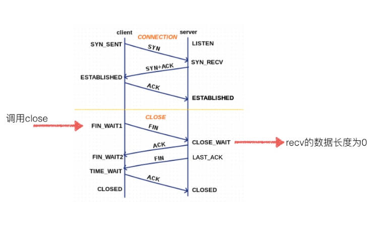

# TCP 连接

## 1. 建立连接
TCP使用三次握手协议建立连接。当主动方发出SYN连接请求后，等待对方回答SYN+ACK，并最终对对方的 SYN 执行 ACK 确认。

TCP三次握手的过程如下：
* (1) 客户端发送SYN（SEQ=x）报文给服务器端，进入SYN_SEND状态。
* (2) 服务器端收到SYN报文，回应一个SYN （SEQ=y）ACK（ACK=x+1）报文，进入SYN_RECV状态。
* (3) 客户端收到服务器端的SYN报文，回应一个ACK（ACK=y+1）报文，进入Established状态。

TCP 标志位|含义
:-|:-
URG | 紧急
ACK | 确认，使得确认号有效。
PSH | 发送数据
RST | 重置连接
SYN | 同步(建立连接)
FIN | 终止。发送方已经结束向对方发送数据。

TCP 标志位为6bit，从左至右分别为 `URG / ACK / PSH / RST / SYN / FIN`。如`0b000010`表示SYN，`0b010000`表示ACK。

## 2. 关闭连接

由于TCP连接是全双工的，因此每个方向都必须单独进行关闭。这原则是当一方完成它的数据发送任务后就能发送一个FIN来终止这个方向的连接。收到一个 FIN只意味着这一方向上没有数据流动，一个TCP连接在收到一个FIN后仍能发送数据。首先进行关闭的一方将执行主动关闭，而另一方执行被动关闭。

TCP四次挥手过程如下：
* (1) TCP客户端发送一个FIN，用来关闭客户到服务器的数据传送。
* (2) 服务器收到这个FIN，它发回一个ACK，确认序号为收到的序号加1。和SYN一样，一个FIN将占用一个序号。
* (3) 服务器关闭客户端的连接，发送一个FIN给客户端。
* (4) 客户端发回ACK报文确认，并将确认序号设置为收到序号加1。

当一个连接被建立或被终止时，交换的报文段只包含TCP头部，而没有数据。也就是说如果接收到的客户端数据长度为0，则意味着客户端断开连接。

## 3. 短链接和长连接
TCP在真正的读写操作之前，server与client之间会通过三次握手建立一个连接，当读写操作完成后，双方不再需要这个连接时会经历四次挥手释放这个连接，每次连接都会有一定的资源和时间消耗。

在建立一次TCP连接之后完成一次数据传输工作后立即关闭连接，这种连接使用方式称为短链接，而连接建立后进行一次数据传输完成后，保持连接不关闭，直接进行后续数据操作直到完成后关闭连接，这种方式则称为长连接。

短连接对于服务器来说管理较为简单，存在的连接都是有用的连接，不需要额外的控制手段。但客户请求频繁，将在TCP的建立和关闭操作上浪费时间和带宽。多数情况下HTTP请求使用短链接的情况居多，一次请求完毕后连接即被释放，故而HTTP是无状态的。

长连接可以省去较多的TCP建立和关闭的操作，减少浪费，节约时间。但可能存在大量闲置连接不关闭，甚至恶意连接，造成资源浪费。可以以客户端机器为颗粒度，限制每个客户端的最大长连接数。通常情况下数据库连接多使用长连接。

## 4. 服务器连接管理

当TCP客户端与服务端完成第一次握手但尚未建立连接时，服务端会将此客户端加入到半连接队列，在三次握手后连接建立，服务端会将客户端从半连接队列已到已连接队列中。

半连接队里与已连接队列中客户端的总和称为TCP服务器最大连接数，即同一时间TCP服务器可以接收的最多客户端连接数。这个数值就是`socket.listen(backlog)`中`backlog`设定的值。需要注意的是，**Linux会忽略用户设置而由系统决定最大连接数**。

TCP服务器会为每个客户端连接创建一个专属Socket对象负责与此客户端进行通信。TCP服务端以连接为单位提供服务。所有客户端连接都被维护在连接队列当中，不同连接之间一般是并行执行，而单个连接内部则是串行执行。

## 5. 共享连接
单客户端连接在服务端是串行执行，这也就意味着单个客户端内部，多任务之间共享一个连接对象时，即便并发请求也会被服务端串行依次处理。如果某此请求执行耗时任务，之后的请求就会等待，客户端在2MSL内没有收到ACK数据包就会执行重发，直到耗时任务行完毕后才会执行后续请求。因此，客户端程序中多任务共享单个连接与单任务执行并无分别。

以上结论可以通过当前项目证明，其执行结果如下图所示。

## 6. 数据库连接池

数据库连接是一个很好案例,实际生产环境中，建立和释放数据库连接都需要耗费一定时间，因此数据连接属于比较珍贵的资源。如果每次客户端请求都新建立一个数据库连接，不仅耗费时间、资源更会对数据库造成压力，数据库能承受的并发连接访问是有限的。但是客户端内多任务共享一个连接又会相互影响，数据库连接池就是为了解决这个问题。

为了避免客户端共享连接造成多任务间相互干扰，我们就需要为每个任务分配不同的数据库连接，而多数任务都是简单短促地执行完成，待任务完成后，我们不关闭数据库连接，而是将其放入一个共享队列中，待到其他任务需要申请数据库连接时，程序就可以直接到共享队列中快速获取一个连额使用而不需再经历三次握手重新建立新的连接，我们称这个共享队列为数据库连接池。

不同的开发平台中对关系型数据库和非关系型数据库都有其各自的对数据库连接池实现和应用。以.Net平台为例，访问关系型数据库完成后调用`IDbConnection`对象的`Dispose()`时(多通过`using`关键字自动实现)会释放`IDbConnection`对象并将其占用的数据库连接归还到连接池中。在非关系型数据库中也有对数据库连接池的应用，如[MongoDB连接池](https://colin-chang.site/architecture/nosql/mongo.html#_8-2-mongo-连接池),在`Mongo Driver`中提供的`MongoClient`对象本身就实现了一个线程安全的连接池。以下是来自其官方的阐述。
 
> Note: The Mongo object instance actually represents a pool of connections to the database; you will only need one object of class Mongo even with multiple threads. See the concurrency doc page for more information.The Mongo class is designed to be thread safe and shared among threads. Typically you create only 1 instance for a given DB cluster and use it across your app. 

更多内容请参阅 https://colin-chang.site/python/senior/tcp.html
